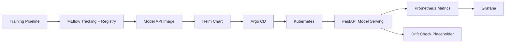

# ML Platform Infrastructure on Kubernetes

ML infrastructure portfolio repo for serving, deploying, observing, and promoting models on Kubernetes. This is intentionally framed as platform engineering for ML workloads, not pure model research.

## What This Builds

- FastAPI-style model serving contract with health, prediction, and metrics endpoints
- Lightweight scoring library and model metadata file for offline tests
- Dockerfile for the model API
- Helm chart for Kubernetes deployment, service, HPA, config, and service account
- Argo CD Application for GitOps delivery
- Prometheus ServiceMonitor and Grafana dashboard starter
- MLflow tracking server local compose file
- Drift-check placeholder and model registry handoff docs
- CI tests that validate code, chart structure, and platform artifacts

## Architecture



## Local Demo

Run tests:

```bash
make test
```

Score a sample payload:

```bash
python -m ml_platform.scoring --model models/sample_model.json --rooms 3 --sqft 1100
```

Run the API if FastAPI is installed:

```bash
cd services/model-api
PYTHONPATH=../.. uvicorn app:create_app --factory --host 0.0.0.0 --port 8000
```

## Platform Deployment Flow

1. Train and register model in MLflow.
2. Build and scan the model API image.
3. Update image tag and model version in Helm values.
4. Let Argo CD reconcile the chart.
5. Monitor latency, error rate, request volume, and prediction warnings.
6. Roll back by reverting the image tag or model version.

## What This Proves

- Can support ML workloads with Kubernetes, Helm, GitOps, and observability
- Understands model serving as an operational platform concern
- Can separate model metadata, runtime, deployment, and monitoring
- Can discuss model registry handoff and rollback paths
