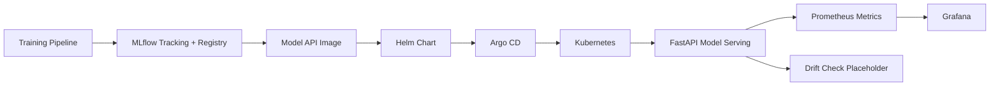

# ML Platform Infrastructure on Kubernetes

[](https://github.com/mrsddq/ml-platform-infrastructure-on-kubernetes/actions/workflows/ci.yml)

An executable model-serving demo with a deterministic linear rental scorer, a tested HTTP contract, and Kubernetes deployment configuration. The coefficients are illustrative; this repository does not train a model, fetch models from MLflow, or demonstrate measured production performance.

## What This Builds

- FastAPI model serving API with health, prediction, and metrics endpoints
- Lightweight scoring library and model metadata file for offline tests
- Dockerfile for the model API
- Helm chart for Kubernetes deployment, service, HPA, config, and service account
- Argo CD Application for GitOps delivery
- Prometheus ServiceMonitor and Grafana dashboard starter
- MLflow tracking server local compose file
- Input-range warnings (not statistical drift detection) and documented model registry handoff
- CI tests that validate code, chart structure, and platform artifacts

## Architecture


```mermaid
flowchart LR
    Data["Training Pipeline"] --> MLflow["MLflow Tracking + Registry"]
    MLflow --> Image["Model API Image"]
    Image --> Helm["Helm Chart"]
    Helm --> Argo["Argo CD"]
    Argo --> K8s["Kubernetes"]
    K8s --> API["FastAPI Model Serving"]
    API --> Metrics["Prometheus Metrics"]
    Metrics --> Grafana["Grafana"]
    API --> Drift["Drift Check Placeholder"]
```

## Local Demo

Install the API and test dependencies, then run tests:

```bash
python -m pip install -e ".[serve,test]"
make test
```

Score a sample payload:

```bash
python -m ml_platform.scoring --model models/sample_model.json --rooms 3 --sqft 1100
```

Run from the repository root:

```bash
uvicorn app:create_app --factory --app-dir services/model-api --host 127.0.0.1 --port 8000
```

## Artifact selection and rollout contract

`MODEL_PATH` selects a JSON artifact inside the image or a mounted volume. Optional
`MODEL_NAME` and `MODEL_VERSION` must match that artifact; startup fails on a missing
file, invalid schema, or identity mismatch. Helm sets all three values. Updating only
`model.version` cannot silently relabel the old model.

```bash
MODEL_PATH=models/sample_model.json MODEL_VERSION=1.0.0 \
  uvicorn app:create_app --factory --app-dir services/model-api
curl -fsS http://127.0.0.1:8000/predict -H 'Content-Type: application/json' \
  -d '{"rooms":3,"sqft":1100}'
# prediction=2475.0; model_version=1.0.0
```

For a new artifact, build and publish an image containing it, then update the image
tag, `model.path`, `model.name`, and `model.version` together. Reverting that complete
configuration provides the rollback path. The default image reference is a deployment
placeholder: build/push your own image before deployment. ServiceMonitor requires the
Prometheus Operator CRD; disable `serviceMonitor.enabled` otherwise.

Tests use a second artifact with a different intercept to verify actual prediction
changes, identity mismatch failures, JSON body handling, invalid inputs, and error
metrics. Counters are thread-safe but process-local; use one worker per pod and sum
across pods. Input-range warnings are a simple heuristic, not a data-drift detector.

## Portfolio Evidence

See [docs/PORTFOLIO_EVIDENCE.md](docs/PORTFOLIO_EVIDENCE.md) for sample scoring output, platform validation commands, and interview proof points.

## Production Docs

- [Architecture](docs/architecture.md)
- [Runbook](docs/runbook.md)
- [Incident response](docs/incident-response.md)
- [Cost estimate](docs/cost-estimate.md)
- [Security controls](docs/security-controls.md)

## Make Targets

```bash
make test
make lint
make score
make security-scan
make local-demo
make deploy
make destroy
```

## Interview Story

This project demonstrates tested API packaging, explicit artifact identity, Helm deployment configuration, an Argo CD manifest, and Prometheus counters. MLflow promotion is a proposed integration; the included compose service is independent of the scorer.

## What This Proves

- Can support ML workloads with Kubernetes, Helm, GitOps, and observability
- Understands model serving as an operational platform concern
- Can separate model metadata, runtime, deployment, and monitoring
- Can discuss model registry handoff and rollback paths
