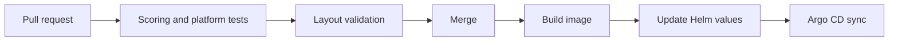
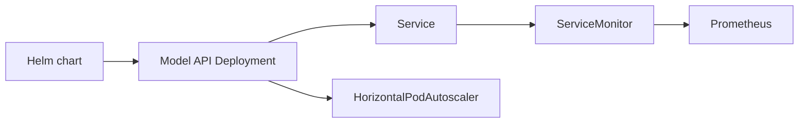
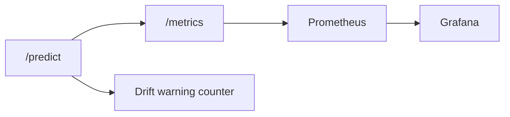

# Architecture

## High-Level Platform

```mermaid
flowchart LR
    Train["Training workflow"] --> MLflow["MLflow tracking and registry"]
    MLflow --> Metadata["Model metadata"]
    Metadata --> API["Model API image"]
    API --> Helm["Helm chart"]
    Helm --> Argo["Argo CD"]
    Argo --> K8s["Kubernetes namespace"]
    K8s --> Service["Model serving service"]
    Service --> Metrics["Prometheus metrics"]
    Metrics --> Grafana["Grafana dashboard"]
```

## CI/CD Flow

```mermaid
flowchart LR
    PR["Pull request"] --> Tests["Scoring and platform tests"]
    Tests --> Layout["Layout validation"]
    Layout --> Merge["Merge"]
    Merge --> Image["Build image"]
    Image --> Values["Update Helm values"]
    Values --> Argo["Argo CD sync"]
```

## Kubernetes Deployment Flow

```mermaid
flowchart LR
    Chart["Helm chart"] --> Deployment["Model API Deployment"]
    Deployment --> Service["Service"]
    Deployment --> HPA["HorizontalPodAutoscaler"]
    Service --> Monitor["ServiceMonitor"]
    Monitor --> Prometheus["Prometheus"]
```

## Observability Flow

```mermaid
flowchart LR
    API["/predict"] --> Metrics["/metrics"]
    Metrics --> Prometheus["Prometheus"]
    Prometheus --> Grafana["Grafana"]
    API --> Warnings["Drift warning counter"]
```
